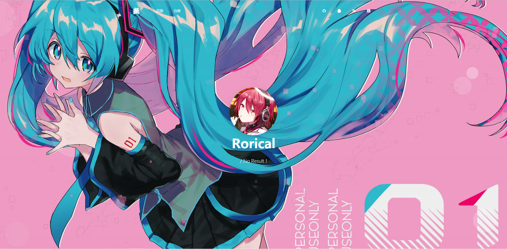

# Rorical
 一个比较可爱的Typecho主题

 在博客被我抛弃了半年时，我又想起了我还有一个博客！
 所以来重新整顿一下，弄一个让自己满意的博客吧
 于是就用[Argon](https://demos.creative-tim.com/argon-design-system/)模板魔改了一个Typecho主题，这就是Rorical主题的由来

 本人还是CSS和PHP渣，所以这次的目的是打造一个轻量的主题，没有那么多的功能，所以想要多功能主题的小伙伴请找找别的主题吧！
 另外本主题还是在测试的阶段，所以有什么想法可以提出来，一起努力完善她！

**注意！**

代码高亮已集成到主题，推荐使用Editor.md来写文章，文章浏览次数统计基于[quarkay](https://www.quarkay.com/)的[ViewsCounter](https://github.com/Quarkay/Typecho-ViewsCounter)，请一并食用

独立页面需要设置专属的标志和颜色，表现在菜单栏上的图标：请在独立页面的自定义字段创建字符 color 和 icon 两个字段，color可用值bg-gradient-success绿色bg-gradient-danger红色bg-gradient-info蓝色bg-gradient-primary紫色bg-gradient-warning橙色bg-gradient-default灰紫色，icon可用值请到[这里](https://demos.creative-tim.com/argon-design-system/docs/foundation/icons.html)查看。（如果不懂可以问我）（以上假如你在设置选择了平铺式的导航栏那duck不必）

设置里的展示最新文章数量建议改成3，获得最佳的非强迫症效果（

*已经弃坑
*已经弃坑
*已经弃坑
*已经弃坑
*已经弃坑
*已经弃坑
*已经弃坑
*已经弃坑
*已经弃坑

博客链接[Rorical](https://blog.boxpaper.club/)

### ScreenShot

